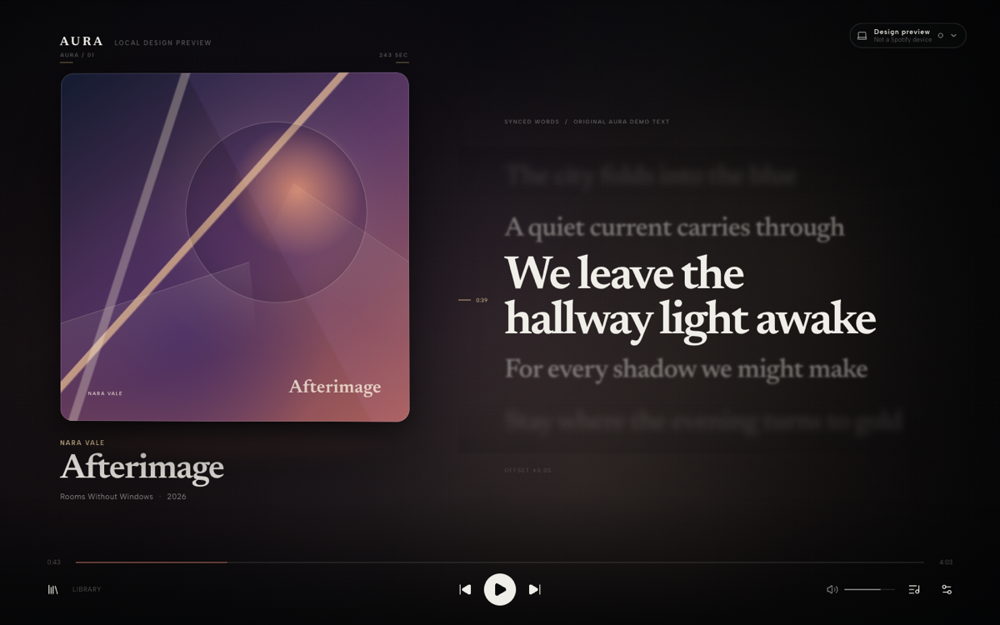
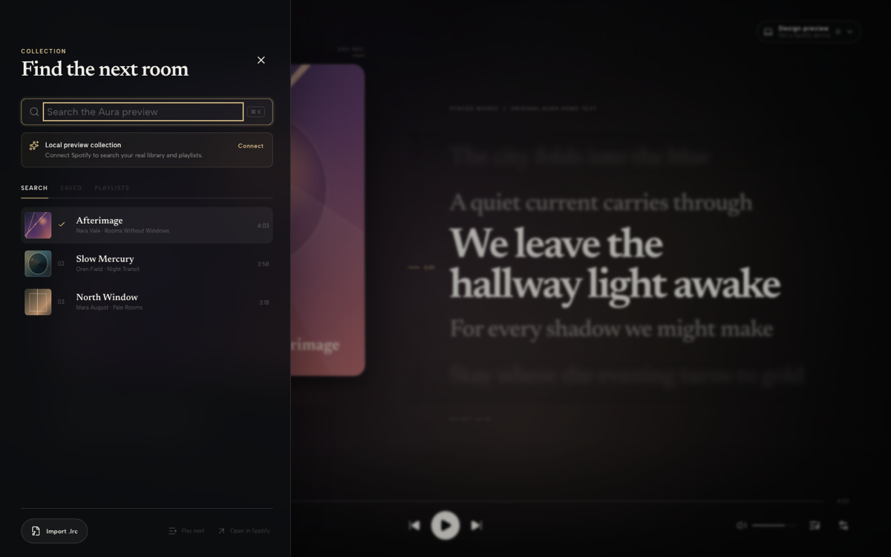

# Aura Player

Aura Player is an artwork-first Spotify remote control for macOS. It pairs
large album art with synchronized lyrics and a restrained procedural visual
environment, while keeping playback controls, exact-device selection, library
access, and settings close at hand. Spotify audio remains on the Spotify device
the user selects; Aura Player does not play or process Spotify audio locally.

The project is intentionally original rather than a reproduction of Spotify's
interface. Its visual direction is editorial, cinematic, soft, and luxurious.

> [!IMPORTANT]
> Aura Player is under active development. The repository includes a real
> Electron foundation and a Spotify Web API remote-control implementation.
> Stock Electron 37 on the macOS 11 target does not expose the Widevine EME
> capability required by Spotify's Web Playback SDK, so Aura Player does not
> register itself as a Spotify playback device. Live remote-control behavior,
> Apple signing, and packaged operation are not considered verified until the
> manual checks in this document have passed on physical Macs.

## Screenshots

| Artwork-first now playing | Secondary library drawer |
| --- | --- |
|  |  |

## Platform support

- macOS 11 Big Sur or newer
- Intel x64
- Apple Silicon arm64, subject to native-dependency verification
- Spotify Premium for Spotify Connect playback-control operations

### Why Electron 37 is pinned

This repository pins Electron to `37.10.3`. Electron 38 drops macOS 11, so
upgrading across that major boundary would break the stated Big Sur target.
Pinning an older major is a compatibility compromise, not a permanent security
strategy: Electron 37 will eventually stop receiving upstream security fixes.
Maintainers must review Electron advisories, avoid untrusted content, and plan a
separate supported-OS branch or a higher minimum macOS version when the risk of
remaining on Electron 37 is no longer acceptable.

At lockfile generation on July 24, 2026, `npm audit` reports high-severity
advisories against the Electron 37 development dependency whose automated fix
requires a later Electron major. `npm audit --omit=dev` reports no production
package advisories, but that does not make the embedded Electron runtime safe:
Electron is a development dependency only because it supplies the packaged
runtime. These advisories are an accepted, documented blocker for public
distribution while macOS 11 remains mandatory.

The package's Node.js requirement applies to development tooling. Packaged
applications use the Node and Chromium versions embedded in Electron 37.

## Current implementation status

The definitive running checklist lives in [TASKS.md](./TASKS.md). In summary:

- The Electron/Vite/React/TypeScript application launches with secure
  main/preload/renderer boundaries, and unsigned x64/arm64 DMG and ZIP packages
  build locally.
- PKCE authentication, a loopback callback, Keychain token storage and refresh,
  and credential-deleting sign-out are implemented.
- Spotify authentication, available-device discovery, explicit exact-device
  selection, remote playback controls, and current-playback synchronization are
  implemented through Spotify's Web API. Selecting an inactive device performs
  one user-initiated transfer without starting playback; audio remains on that
  selected Spotify device.
- Embedded Spotify playback and Aura-as-a-Connect-device registration are not
  shipped. A runtime EME probe confirmed that stock Electron 37 cannot provide
  the Widevine capability required by Spotify's Web Playback SDK on the macOS 11
  compatibility line.
- The artwork-first interface, deterministic Canvas visual engine, local palette
  extraction, six visual modes, synchronized and restart-persistent `.lrc`
  import, provider adapters, menu-bar controls, settings, shortcuts, and preview
  experience are implemented.
- The secondary library supports live Spotify search, saved tracks, playlists,
  playlist browsing, pagination, playback, queue/play-next, and safe
  open-in-Spotify actions, with honest loading, empty, offline, rate-limit, and
  unavailable states.
- Native power/network recovery signals, cache inspection and clearing, strict
  playback-state sequencing, and credential-safe sign-out cancellation are
  implemented. Physical sleep/wake behavior still requires manual verification.
- Lint, strict type checking, 189 unit tests, three isolated Electron
  end-to-end flows, the production build, and the x64/arm64 packaging command
  pass.
- Apple signing/notarization, physical Intel/Apple Silicon testing, and the live
  Spotify remote-control checks remain external release gates.

## Prerequisites

- macOS 11 or newer
- Node.js `>=22.13.0`
- npm 10 or newer
- Xcode Command Line Tools for rebuilding `keytar`
- A Spotify developer application
- A Spotify Premium account for playback testing
- Apple Developer signing credentials for signed release artifacts

## Spotify developer application setup

1. Create or open an application in the Spotify Developer Dashboard.
2. Copy its client ID.
3. Register this exact redirect URI:

   ```text
   http://127.0.0.1:43821/callback
   ```

4. Add your Spotify account to the application's allowlist while the
   application remains in development mode.
5. Copy `.env.example` to `.env` and add the client ID:

   ```dotenv
   VITE_SPOTIFY_CLIENT_ID=your_client_id
   VITE_SPOTIFY_REDIRECT_URI=http://127.0.0.1:43821/callback
   ```

Spotify client IDs are public identifiers. Do not create, embed, or commit a
Spotify client secret. Desktop authentication must use Authorization Code Flow
with PKCE.

Request only scopes used by the finished application. The expected set is:

```text
user-read-playback-state
user-modify-playback-state
playlist-read-private
playlist-read-collaborative
user-library-read
```

Remove any scope whose corresponding feature is not shipped.

## Install and run

```bash
npm install
npm run dev
```

The install step rebuilds native production dependencies for the pinned
Electron runtime. If `keytar` fails to build, confirm Xcode Command Line Tools
are installed, then run:

```bash
npm run rebuild:native
```

## Commands

| Command | Purpose |
| --- | --- |
| `npm run dev` | Run main, preload, and renderer processes with hot reload |
| `npm start` | Preview a completed Electron build |
| `npm run lint` | Run ESLint with warnings treated as failures |
| `npm run typecheck` | Type-check Node, web, and test projects |
| `npm test` | Run Vitest unit tests once |
| `npm run test:watch` | Run Vitest in watch mode |
| `npm run test:e2e` | Build and run Playwright Electron tests |
| `npm run build` | Type-check and build all Electron process bundles |
| `npm run package` | Produce an unpacked application for local inspection |
| `npm run package:mac` | Build x64 and arm64 DMG and ZIP artifacts |

## Architecture

```text
src/
├── main/       Electron lifecycle, windows, OAuth callback, Keychain, tray, IPC
├── preload/    Narrow typed contextBridge API
├── renderer/   React UI, Spotify Web API clients, visuals, lyrics, library
└── shared/     IPC schemas, shared types, constants, settings validation
```

The renderer must never import Node or Electron modules. Main-process
capabilities are exposed through a narrow preload API, and every IPC payload is
validated with Zod on the receiving side.

The main bundle uses ESM. The sandboxed preload is deliberately emitted as one
bundled CommonJS file; Electron does not support ESM imports in sandboxed
preloads, and its restricted preload `require` cannot load arbitrary npm
packages. Third-party validators are bundled into the preload, leaving only
Electron built-ins as runtime imports. Do not re-enable dependency
externalization for that build.

### Authentication and token storage

- Generate the OAuth state, PKCE verifier, and challenge locally.
- Open Spotify authorization in the user's default browser.
- Accept callbacks only at the configured loopback address and exact path.
- Compare OAuth state using a timing-safe strategy where practical.
- Store access and refresh tokens only in macOS Keychain through `keytar`.
- Keep tokens out of renderer persistence, query strings after callback
  handling, crash reports, analytics, and logs.
- Delete stored credentials on sign-out.

### Playback boundary

Renderer components depend on a `PlaybackService` interface rather than calling
Spotify directly. The shipped implementation is a Spotify Connect remote
controller backed by Spotify's Web API:

1. Aura authenticates with PKCE and discovers the account's available Spotify
   devices.
2. The user explicitly selects one exact device. Aura never silently chooses a
   target.
3. If that device is inactive, Aura requests a single transfer with
   `play: false`, then confirms that the same device became active.
4. Play, pause, seek, skip, and supported volume commands include that exact
   device ID. Current playback is polled to keep metadata and progress honest.

Audio is produced by the selected Spotify device, not by Electron. Closing Aura
does not turn another Mac, phone, speaker, or browser into an Aura-owned device.
The selected device ID is runtime state rather than a persisted credential, so
the user chooses a target again after reconnecting.

Local embedded Spotify playback is intentionally unsupported on the macOS 11
build. Stock Electron 37 does not expose the Widevine EME capability required by
Spotify's Web Playback SDK, and the SDK reports an initialization failure.
Aura therefore does not load the SDK, request the `streaming` scope, advertise
`Aura Player — Mac` in Spotify's Available Devices, or claim local audio
playback. The `PlaybackService` abstraction remains replaceable, but any future
local implementation needs a supported DRM path and a separate product decision
about raising the minimum macOS version. Aura never captures, downloads,
proxies, records, or alters Spotify audio.

### Lyrics

Spotify's public Web API does not provide full lyrics. Aura Player supports a
provider-independent model:

- user-imported `.lrc` files;
- a separately licensed lyrics API;
- source adapters for sites the user owns, controls, or has explicit permission
  to scrape.

Authorized scraper adapters must be disabled by default and must respect source
terms, `robots.txt`, crawl delay, strict rate limits, and access controls. Never
bypass authentication, CAPTCHAs, paywalls, robots restrictions, or anti-bot
systems. Never target Spotify, Genius, Musixmatch, or another prohibited source.
Do not bundle copyrighted lyric text in fixtures.

Imported files are stored in the application user-data directory with validated
metadata sidecars. They are matched by Spotify track ID, ISRC, or normalized
artist/title, can be listed and removed in Settings, and never leave the Mac.
Aura checks for a match automatically on every track change. Synchronized files
render as a full, keyboard-scrollable lyric score with one honest active line,
line-level timing progress, intentional instrumental passages, a fixed reading
axis, and reduced-motion support.

Automatic third-party lyric lookup is not enabled. Spotify's current
[Compliance Tips](https://developer.spotify.com/compliance-tips) explicitly
list synchronizing Spotify recordings with lyrics as a disallowed use case, and
the [Developer Policy](https://developer.spotify.com/policy) restricts sending
Spotify-derived data to another service. Any network provider therefore requires
applicable lyric-content rights and written Spotify approval before release.

### Local settings

Non-sensitive preferences may be persisted locally. Credentials and tokens may
not. Settings must be parsed through the shared schema before use so corrupted
or older values fall back safely.

## Security model

Every application window must use these defaults:

```ts
{
  contextIsolation: true,
  nodeIntegration: false,
  sandbox: true,
  preload: PRELOAD_PATH
}
```

Additional invariants:

- maintain a restrictive Content Security Policy;
- deny unexpected window creation and navigation;
- open allowlisted HTTPS links through the system browser;
- reject malformed or oversized IPC payloads;
- never render remote HTML;
- sanitize imported file names and resolve paths defensively;
- never disable Electron security warnings;
- never log tokens, personal data, lyric contents, or full Spotify responses;
- do not expose arbitrary filesystem, shell, network, or IPC primitives to the
  renderer.

See [AGENTS.md](./AGENTS.md) before changing process boundaries.

## Testing

Unit tests do not require a Spotify account and cover pure behavior such as:

- PKCE generation and OAuth-state validation;
- token expiry calculations and Spotify error mapping;
- LRC parsing, lyric matching, and active-line selection;
- player/store transitions;
- settings defaults and validation;
- IPC schema validation.

Playwright tests launch Electron with a unique temporary user-data directory and
an explicit ephemeral credential store. They exercise the honest local preview,
track changes, keyboard lyrics, settings persistence, the sandboxed preload
bridge, and the fullscreen request boundary without reading the developer's
real Keychain. Live Spotify checks are deliberately separate because they
require a developer application and a Premium account.

Run the standard local gate:

```bash
npm run lint
npm run typecheck
npm test
npm run build
```

## Manual Spotify verification

Use a Spotify developer application and a physical Premium account. Record the
Electron version, macOS version, CPU architecture, and result of each check.

- [ ] Login opens in the default browser and returns only through the expected
      loopback callback.
- [ ] Cancelled login and state mismatch show useful errors.
- [ ] Tokens refresh after expiration.
- [ ] Credentials survive restart through Keychain and disappear on sign-out.
- [ ] Device discovery lists the account's currently available Spotify devices
      without inventing an Aura-owned device.
- [ ] No target is selected and transport controls remain unavailable until the
      user explicitly chooses a device.
- [ ] Selecting an inactive target transfers playback once with `play: false`
      and does not start or restart audio.
- [ ] Every command continues to address the selected device; if Spotify reports
      a different active target, Aura stops presenting itself as ready.
- [ ] Play, pause, previous, next, seek, and supported volume commands control
      playback on the selected Spotify device.
- [ ] Track metadata, duration, and artwork update correctly.
- [ ] Audio remains on the selected phone, speaker, desktop app, or web player;
      Aura itself never appears as an audio-output device.
- [ ] Sleep/wake and a temporary network interruption recover cleanly.
- [ ] A non-Premium account receives a clear explanation.
- [ ] Spotify rate limiting backs off without a retry loop.
- [ ] Tokens and private data are absent from logs.

## Packaging

Unsigned local artifacts can be built with:

```bash
npm run package:mac
```

The builder declares DMG and ZIP targets for x64 and arm64 with a macOS 11
minimum. A declaration is not proof that both artifacts work: `keytar`, Web
API remote control, login callbacks, fullscreen, tray behavior, and sleep/wake
recovery must be exercised on each architecture.

Distribution requires an Apple Developer ID Application certificate,
notarization credentials, and an explicit release process. Production icons and
hardened-runtime entitlements are included; signing credentials are
intentionally absent from the repository. Do not disable hardened runtime or
library validation to make signing pass.

## Spotify development-mode limitations

Spotify may restrict development applications to explicitly allowlisted users,
limit quotas, or require review before broader distribution. Aura Player should
be treated as personal/non-commercial software unless Spotify grants broader
approval. Spotify policy and Web API availability can change independently of
this repository; verify current terms before any release.

## Troubleshooting

### `keytar` fails during install or packaging

Install Xcode Command Line Tools, confirm the active architecture, then run
`npm run rebuild:native`. Universal packaging still needs separate validation
of the x64 and arm64 binaries.

### Spotify redirects to a browser error

Confirm the dashboard redirect URI exactly matches
`http://127.0.0.1:43821/callback`, including scheme, host, port, and path. Also
confirm the account is allowed to use the development application.

### Login succeeds but playback does not start

Aura does not start playback merely because authentication succeeded. Open the
device picker, choose the exact Spotify device that should produce audio, and
then use the transport controls. Confirm the account is Premium, the target
device remains available, and Spotify is online. Selecting a device transfers
the session with `play: false`, so press Play explicitly if playback was paused.

### A phone, speaker, desktop app, or web player does not appear

Open Spotify on the intended target so it advertises itself to Spotify Connect,
then refresh Aura's device list. Confirm both applications use the same account
and that the account is Premium. Aura does not register `Aura Player — Mac` as
an output device; it only controls devices Spotify already reports. Do not
force-transfer in a retry loop.

### Local audio is silent

This is expected. The macOS 11 build is a remote control, and audio remains on
the explicitly selected Spotify device. Embedded playback is unavailable
because stock Electron 37 lacks the Widevine EME capability required by
Spotify's Web Playback SDK.

### Lyrics are unavailable

Import a matching licensed `.lrc` file. Aura will store it locally and match it
automatically the next time that track appears. Aura Player must not invent
lyrics, silently scrape an unapproved source, or transmit Spotify metadata to a
third-party lyric service without the required rights and approval.

## Known limitations

- Aura is a Spotify Connect remote control, not a Spotify audio-output device.
  It does not appear in Available Devices and does not play Spotify audio
  locally.
- Embedded Web Playback SDK playback is unsupported on stock Electron 37 because
  the macOS 11-compatible runtime lacks the required Widevine EME capability.
- Spotify remote-control operations require Premium and remain subject to live,
  packaged verification on both target architectures.
- Electron 37 preserves macOS 11 compatibility at the cost of an older Chromium
  security baseline.
- Apple signing and notarization require credentials supplied outside source
  control.
- Spotify lyrics are unavailable through the public Web API.
- Licensed lyric-provider credentials are not bundled.
- Authorized scraper providers are off until explicitly configured.
- Development-mode Spotify applications may be limited to allowlisted users.

## License

This repository is currently private and unlicensed. Spotify and its marks are
the property of Spotify AB; Aura Player is not affiliated with or endorsed by
Spotify.
